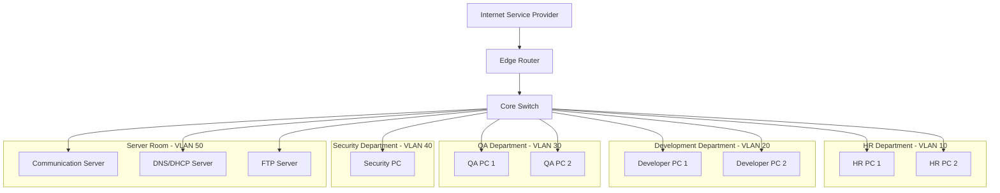
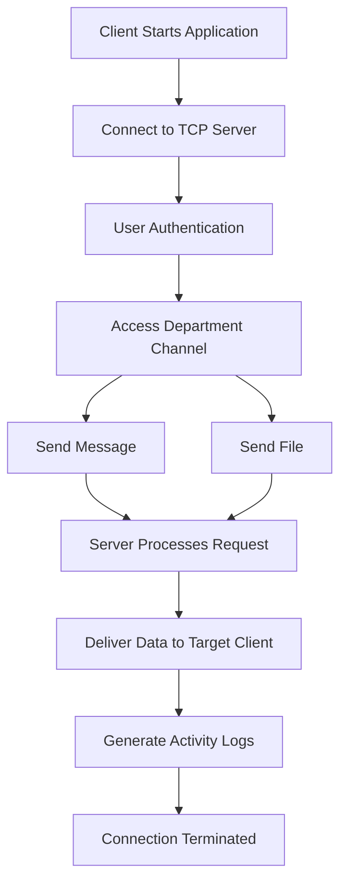

# 🚀 NexaLAN

## Smart Software House Network & Secure Internal Communication System

> A complete enterprise network simulation and TCP socket-based communication platform designed for modern software houses.

---

# 📌 Project Proposal

---

# 📖 Introduction

## 📍 Background

Modern software houses depend heavily on secure communication, organized network infrastructures, and efficient file-sharing systems for daily operations. As organizations grow, managing communication between multiple departments becomes increasingly difficult without proper network segmentation and centralized communication systems.

Traditional communication platforms often rely on third-party internet services, which may introduce:

* Security vulnerabilities
* Privacy concerns
* Network dependency
* Additional operational costs

To address these challenges, enterprise organizations implement secure Local Area Networks (LANs), VLAN segmentation, centralized servers, and internal communication systems.

---

## 🎯 Project Overview

**NexaLAN** is a smart enterprise networking and communication solution that combines:

* Enterprise-grade network infrastructure simulation
* Secure department-based communication
* Internal file-sharing system
* Client-server communication architecture
* Real-time messaging system

The project will be developed using:

* Cisco Packet Tracer for enterprise network simulation
* C Socket Programming for communication and file-sharing system implementation

---

## 🏢 Target Environment

The proposed network infrastructure simulates a real software house environment containing multiple departments such as:

* Administration
* Human Resources
* Developers
* Quality Assurance
* Cybersecurity Team
* Server Room
* Guest Network

Each department will operate within isolated VLANs to ensure security, traffic management, and controlled communication.

---

# 📚 Literature Review

## 🌐 Enterprise Networking

Enterprise networks are designed to ensure secure, scalable, and efficient communication between organizational departments. Technologies such as:

* VLANs
* DHCP
* DNS
* Routing
* Access Control Lists (ACLs)
* Network Segmentation

are commonly implemented to improve network performance and security.

VLANs allow logical separation of departments while using the same physical infrastructure, reducing unnecessary broadcast traffic and improving overall security.

---

## 💻 Socket Programming

Socket programming enables communication between systems over a network using protocols such as:

* TCP (Transmission Control Protocol)
* UDP (User Datagram Protocol)

TCP socket programming provides:

* Reliable communication
* Ordered data transfer
* Error checking
* Persistent client-server connections

These concepts are widely used in:

* Messaging systems
* File transfer applications
* Distributed systems
* Enterprise communication software

---

## 🔐 Network Security

Modern organizations require secure communication systems to protect sensitive information from unauthorized access. Security mechanisms such as:

* ACL rules
* Port Security
* Authentication Systems
* Access Restrictions

help maintain confidentiality and network integrity.

---

## 📌 Existing Solutions

Most existing academic projects focus either on:

* Network simulation only
  OR
* Chat applications only

Very few projects integrate:

* Enterprise network infrastructure
* Secure communication
* File-sharing system
* Multi-client server architecture

within a single platform.

**NexaLAN** aims to bridge this gap by integrating practical enterprise networking with real-time communication software.

---

# ❗ Problem Statement

Software houses require efficient internal communication systems to manage collaboration between departments securely and effectively.

However, organizations commonly face the following issues:

* Lack of secure internal communication
* Poor network segmentation
* Unauthorized access between departments
* Network congestion
* Uncontrolled file-sharing mechanisms
* Dependency on external communication platforms
* Inefficient centralized communication management

Small and medium-sized software houses often cannot afford expensive enterprise communication solutions and require a low-cost, secure, and manageable alternative operating entirely within a Local Area Network (LAN).

Therefore, there is a need for a system that:

* Simulates a secure enterprise network
* Provides real-time communication
* Supports secure file sharing
* Implements department-based access
* Demonstrates practical networking concepts

---

# 🧩 Proposed Solution

## 💡 NexaLAN Solution

NexaLAN proposes:

* A fully simulated enterprise software house network
* Department-wise VLAN implementation
* Secure internal communication system
* Multi-client TCP server architecture
* Real-time messaging system
* Internal file-sharing capabilities

The project will provide a realistic implementation of modern networking concepts combined with systems programming.

---

# ⚙️ System Features

## 🌐 Networking Features

* VLAN Segmentation
* Inter-VLAN Routing
* DHCP Configuration
* DNS Services
* FTP Server
* Email Server
* SSH Remote Access
* ACL Security Rules
* Port Security

---

## 💬 Communication Features

* Multi-client communication
* Real-time messaging
* Department-based channels
* Secure file sharing
* User authentication
* Server-side logging
* Online user monitoring
* Broadcast announcements

---

# 🏗️ System Architecture

## 🖧 Enterprise Network Diagram

---

# 🔄 Communication Flow Diagram

---

# 🛠️ Technologies Used

| Category               | Technology                |
| ---------------------- | ------------------------- |
| Network Simulation     | Cisco Packet Tracer       |
| Programming Language   | C                         |
| Communication Protocol | TCP/IP                    |
| Networking Concepts    | VLANs, Routing, DHCP, DNS |
| Socket Programming     | TCP Sockets               |
| Operating System       | Linux / Windows           |
| Development Tools      | GCC Compiler, VS Code     |

---

# 🎯 Objectives

## Primary Objectives

* Design a secure enterprise network
* Simulate software house infrastructure
* Develop a multi-client communication system
* Implement secure file sharing
* Demonstrate practical networking concepts

---

## Secondary Objectives

* Improve understanding of TCP/IP communication
* Implement real-world client-server architecture
* Apply VLAN segmentation practically
* Explore network security mechanisms

---

# 📈 Expected Outcomes

The project is expected to:

* Demonstrate secure enterprise networking
* Enable internal communication between departments
* Provide reliable file-sharing capabilities
* Improve understanding of computer networking concepts
* Simulate real-world software house infrastructure

---

# 🔮 Future Enhancements

Future improvements may include:

* GUI-based communication software
* AES Encryption
* Database integration
* Voice communication
* Video conferencing
* Cloud synchronization
* Mobile client application

---

# 📚 References

1. Computer Networking: A Top-Down Approach

2. Data Communications and Networking

3. Computer Networks

4. Stevens, W. Richard. *UNIX Network Programming: Sockets and Networking APIs.*

5. RFC 793 – Transmission Control Protocol (TCP)

6. RFC 768 – User Datagram Protocol (UDP)

7. Cisco Packet Tracer Documentation and Networking Labs

---

# 👨‍💻 Project Name

# **NexaLAN**

### *Smart Software House Network & Secure Internal Communication System*
